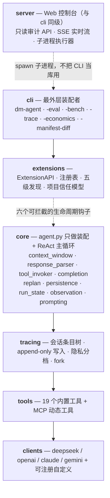

# DM-Code-Agent

<div align="center">

**本地优先 · 全程可审计 · 内核只有一个 ReAct 循环**

[](https://github.com/hwfengcs/DM-Code-Agent/actions/workflows/ci.yml)
[](https://github.com/hwfengcs/DM-Code-Agent/tree/main/tests)
[](https://www.python.org/downloads/)
[](https://github.com/hwfengcs/DM-Code-Agent/blob/main/LICENSE)
[](https://github.com/hwfengcs/DM-Code-Agent/stargazers)
[](https://github.com/hwfengcs/DM-Code-Agent/commits/main)
[](https://github.com/hwfengcs/DM-Code-Agent/tree/main/docs)
[](https://github.com/hwfengcs/DM-Code-Agent/tree/main/docs/research-log)

**中文** | [English](https://github.com/hwfengcs/DM-Code-Agent/blob/main/README_EN.md)


</div>

一个**你能读懂、能复现、能扩展**的 Python Code Agent。它在你本地工作区读写文件、跑测试、
跑 lint、调 MCP 工具，并把每一步计划、工具调用和观察结果写成 **append-only 的会话日志**——
出了问题可以回放、可以诊断、可以**从任意一步分叉重跑**。

它不是又一个聊天黑盒：内核只有 ReAct 主循环，可选能力都是挂在
生命周期钩子上的扩展；上下文折叠**不删原文**，所以 ablation 结论真的能被验证。

> 如果这个项目对你有用，点个 ⭐ 让更多人看到。

---

## ⚡ 60 秒上手

```bash
git clone https://github.com/hwfengcs/DM-Code-Agent.git && cd DM-Code-Agent
uv sync --frozen --extra dev        # 或 pip install -e ".[dev]"
cp .env.example .env                # 填入至少一个 API key
```

```bash
# 跑一个任务，同时留一份可审计的会话日志
dm-agent "修复 retry.py 的重试边界，并运行测试" --trace sessions/fix.jsonl --show-steps

# 立刻诊断这次运行：哪一步失败、有没有重规划恢复、有没有跳过验证
dm-agent-trace analyze sessions/fix.jsonl
```

**先试不掏钱**：测试、确定性 eval 和 benchmark manifest 检查**完全不需要 API key**。

```bash
python -m pytest && python -m dm_agent.evals.cli --variant full --task direct_finish
```

想在浏览器里看：

```bash
dm-agent-web --read-only            # 只读展厅：审计会话，不需要 API key
dm-agent-web                        # 完整工作台：对话式交任务 + 实时看每一步
```

终端会打印一条带 token 的地址，点开即可。详见 [Web 控制台](https://github.com/hwfengcs/DM-Code-Agent/blob/main/docs/web.md)。

---

## ⭐ 七个别处没有的东西

### 🌳 运行历史是一棵永不删除的树

别的 agent 压缩上下文 = 扇掉历史，事后没法追。这里每条日志带 `id` 和 `parent_id`，
折叠只**追加**一条「我压缩了」的派生记录，**原文一条不删**。所以你能：

```bash
dm-agent-trace view       sessions/fix.jsonl    # 看时间线
dm-agent-trace analyze    sessions/fix.jsonl    # 诊断失败阶段 / 恢复情况 / 验证缺口
dm-agent-trace diff       a.jsonl b.jsonl       # 对比两次运行
dm-agent-trace fork       sessions/fix.jsonl --at 4f4bdeee-0007   # 从第 7 条分叉重跑
dm-agent-trace replay     sessions/fix.jsonl    # 显式重放工具调用
dm-agent-trace analyze-dir sessions/             # 批量聚合统计
```

### 📉 上下文折叠带净收益护栏，压亏了就整体回滚

折叠是**本地确定性**的（Mem0 风格原子记忆），不额外烧一次 LLM 调用。更关键的是它会算账：
`estimated_tokens_after < estimated_tokens_before` 才提交，**无收益的候选完整回滚**
（memory、cadence、摘要状态全部还原）。已证明正收益的折叠会跨请求、跨 run 粘性复用，
trace 里明写 `phase=sticky_reuse`，不把复用计成一次新压缩。

### 🖥️ 浏览器里对话，浏览器里审计

```bash
dm-agent-web --read-only     # 只读展厅：免 API key，能审计不能发起运行
dm-agent-web                 # 完整工作台：对话式交任务 + SSE 实时看每一步
```

主界面是一个**对话窗口**，而且是真多轮——同一段对话里第二轮记得第一轮做过什么、
读过哪些文件。实现方式是给 CLI 加了一个长驻模式（`--conversation-stdin`）：一个
子进程、一个 `ReactAgent`、顺序跑多轮，对话历史和本地记忆天然延续。切换视图、
甚至刷新浏览器都不会中断正在跑的轮次。

四个审计视图各回答一个问题：**会话库**（哪些跑成功了，以及**哪些跑成功了但过程
不健康**；支持删除，删除是移进 `sessions/.trash/` 而不是抹掉）、**运行详情**
（对话 / 执行链 / 诊断 / 折叠四个分区）、**诊断**（失败在哪个阶段、有没有恢复、
有没有跳过验证）、**行为 diff**（两次运行从第几步开始分道扬镳）。

三条边界让它不会变成「第二个事实来源」：

- **live run 与历史 trace 共用一套渲染器**——它们本来就是同一份 append-only JSONL。
  对话界面只是这份条目流的另一种排版，所以历史会话也能以对话形式打开。
- **前端不算任何结论**。失败阶段、健康度、验证缺口全部由 `dm_agent.tracing` 算好送过来，
  与 `dm-agent-trace analyze` 同源；`tests/test_server_readonly.py` 有一条断言逐字段比对
  API 响应与直接调用纯函数的结果，防止 server 层自己算一遍导致漂移。
- **发起运行 spawn 一个 CLI 子进程**（`python -m dm_agent.cli`），而不是在服务进程里
  另装一套 `ReactAgent`。所以 Web 永远和命令行做同一件事。

只读展厅用 hash 路由 + `base: './'`，把构建产物和会话 JSONL 一起丢到任何静态托管上就能跑，
**不需要后端，也不需要 key**。详见 [Web 控制台](https://github.com/hwfengcs/DM-Code-Agent/blob/main/docs/web.md)。

### 🔌 加工具 / 守卫 / 模型供应商，一行内核代码都不用改

写一个导出 `setup(api)` 的 `.py` 丢进目录就行。四个注册方法
（`register_tool` / `register_skill` / `register_provider` / `on`）＋
**六个可拦截的生命周期钩子**：

| 钩子 | 你能干什么 |
| --- | --- |
| `before_tool_call` | 改参数，或 `{block, reason}` 直接拦下危险操作 |
| `after_tool_result` | 中间件式改写 observation |
| `before_llm_request` | 发给模型前改写 messages |
| `before_finish` | 否决「假装做完了」 |
| `on_run_start` / `on_run_end` | 改 metadata / 追加 prompt / `{retry: True}` 重跑一轮 |

[`examples/block_dangerous_shell.py`](https://github.com/hwfengcs/DM-Code-Agent/blob/main/examples/block_dangerous_shell.py) 是一个 25 行的
可运行例子：拦住 `rm -rf`。发现来源有五级优先级（builtin → entry_points → 用户目录 →
项目目录 → `--extension`），**项目本地扩展需要显式信任**才会加载。

### 🛡️ 护栏默认开，行为默认关

这条分类原则写进了项目宪法，不是随口一说：

| 默认**开**（基础设施护栏） | 默认**关**（行为 / 算法） |
| --- | --- |
| read-before-edit 守卫、观察截断、token 预算触发折叠 | Adaptive Replanning（错误信号映射到重规划策略） |
| 原子写 + 自动备份、LLM 统一重试 | |
| `--checkpoint` / `--resume` run 级断点续跑 | |

两个面向真实代码库的能力保持默认关闭，可分别启用：

```bash
dm-agent --enable-repo-map "定位并修复订单金额计算问题"
dm-agent --enable-repo-map --enable-verified-edits "修复订单金额计算并补回归测试"
```

`--enable-repo-map` 会在 `.dm_agent/index/workspace.db` 中维护内容哈希、FTS5、作用域
符号以及调用/导入/继承关系；文件修改后只重建变化记录，并反向传播得到受影响符号、
文件、测试与风险分数。动态 Repo Map、Agent 上下文和 Planner/Replanner 共用这份有界证据。
`--enable-verified-edits` 把本轮所有写操作纳入同一事务，完成前校验 Python 语法，并按
同一影响报告选择相关测试；校验未通过时恢复修改前字节快照并否决本次完成。影响计算、
测试选择及原因同时写入 trace，关闭两个开关时不安装这些 capability，保持原有执行路径。

新用户拿到的是一个**安全的**默认配置；研究者按需 `--enable-xxx` 打开单个变量做 ablation。

v2.1 做了一次减法：把 6 个**毕业标准依赖已冻结评测**的默认关模块删掉了
（Reflexion / Critic / Self-Consistency / 熔断 / 记忆卫生 / LLM 压缩），CLI 开关 35 → 23。
要复活其中任何一个，写成外部扩展即可——这正是扩展系统存在的意义。

### 🔬 没有 API key 也能跑完整验证

| | |
| --- | --- |
| 单元测试 | **554 passed，1 skipped**（默认不需要 API key） |
| 确定性 eval | 14 个任务 × 4 个变体，scripted client 驱动，**零网络调用** |
| 前端 | vitest 覆盖展示层纯函数；CI 重新构建并**逐字节比对**入库产物 |
| CI 矩阵 | Ubuntu + Windows × Python 3.10 / 3.11 / 3.12，**6 个组合** |
| 质量门禁 | ruff（`E F I UP B SIM TID RUF`）+ black + mypy + `uv lock --check` + pre-commit |
| 分层契约 | `clients → tools → tracing → core → extensions → cli`，由 ruff `TID251` 在 CI 强制 |

内核最小化体现在职责拆分：`agent.py` 只负责装配与 ReAct 主循环，折叠、解析、工具调用、持久化和完成判定均由同层协作者负责。

### 🧪 不吹分数

**本项目不声明任何未实际运行过的评测分数提升。** 旧 SWE-bench Lite 的 Docker/Tier-2 verifier 与
跨模型跑分**冻结**，SWE-bench Lite 子系统已在 v2.1 移除（它跑不通：Tier-1 baseline
0.0% resolved 且受 host verifier 噪声污染，Tier-2 verifier 从未实现）。

独立的 `swebench_verified/` 子系统已用官方 SWE-bench 4.1.0 harness 完成真实跨仓库
运行：20 题 resolved 11/20（55%），50 题 resolved 21/50（42%），最终 error=0。
20 题是 50 题的严格前缀，不是独立复验；完整边界见 [devlog 42](docs/research-log/42-swebench-crossrepo-50.md)。

记分牌是自带的 **coding + maintenance benchmark**：**30 道题**（coding 15 + maintenance 15），隐藏测试判 pass/fail，
不依赖 Docker 与 HuggingFace；13 题只是历史 baseline。

13 题时代的存档 baseline 是 `pass_rate 0.385（5/13）`，而隐藏测试通过率 `0.769`——
差距全在「改了不该改的文件」和「步数耗尽」上（`bench_reports/baseline-20260803.json`，
对应旧任务集，不可与 30 题分数直接比较）。

```bash
dm-agent-bench --suite all --provider deepseek --output bench_reports/after.json
dm-agent-score-diff bench_reports/before.json bench_reports/after.json
```

输出**逐题 pass/fail 翻转**而不只是总分——回归即使在总分上升时也单独列出。
30 题规模下一题翻转是 ±3.3 个百分点，这是分辨率而非实测噪声；repeat-3 的经验噪声底约为 ±5 题。完整口径见[项目现状](https://github.com/hwfengcs/DM-Code-Agent/blob/main/docs/project-status.md)。

### 📌 最近八轮做成了什么

从越界修改、编辑自伤和误报 replan 的过程护栏，到确定性 manifest、官方 harness 真实跨仓库运行与离线失败分析，关键结论和证据已整理在[最近八轮进展](docs/recent-progress.md)。

---

## 👀 一次真实运行长什么样

下面是**真跑出来的输出**（确定性 eval 的 `tool_failure_replan` 任务，无需 API key）——
读文件失败 → 触发重规划 → 换路径完成：

```console
$ dm-agent-trace view sessions/demo.jsonl
Trace run: 4f4bdeee197d415e8fc8992c227605f9
Task: If reading missing.txt fails, create recovered.txt instead.
Status: success
Provider: deepseek
Model: deepseek-chat
Events: 22
Steps: 3

1. read_file -> 文件 missing.txt 不存在。
2. create_file -> 已将 24 个字符写入 recovered.txt。
3. task_complete -> 任务完成：recovered

Final: 任务完成：recovered
```

`analyze` 不只告诉你成功了，还会**指出它偷的懒**——这次它没跑任何验证就宣布完成：

```console
$ dm-agent-trace analyze sessions/demo.jsonl
Trace analysis
Status: success
Primary failure stage: tool
Final failure stage: none
Recovery: failures=1, replans=1, replanned_after_failure=true, recovered=true
Verification: actions=0, before_finish=false, gap=true
Hallucination signals: edit_without_read=0, guard_blocks=0, truncations=0, missing_paths=1
Health: warning (0.80)
Issues:
- verification_gap
```

这就是「可审计」的意思：**任务成功 ≠ 过程健康**，而后者是能被机器读出来的。

---

## 🏗️ 架构一眼看完



依赖**单向向下**（`clients → tools → tracing → core → extensions → cli`），
由 ruff `TID251` 在 CI 强制——`core` 层想 import `cli` 会直接构建失败。
`server` 与 `cli` 同级：它 spawn CLI 子进程，所以 Web 界面永远和命令行做同一件事，
这条由 `tests/test_server_layering.py` 的 AST 断言守着。
文字版权威说明见 [docs/architecture.md](https://github.com/hwfengcs/DM-Code-Agent/blob/main/docs/architecture.md)。

---

## 📊 v.s. 同类项目

| 维度 | DM-Code-Agent | Aider | OpenHands | SWE-agent | smolagents |
| --- | --- | --- | --- | --- | --- |
| 本地优先（无沙箱依赖） | ✅ | ✅ | docker | docker | ✅ |
| 会话日志 + Replay | ✅ JSONL 条目树 + dry/tool replay + diff + fork | git diff | server log | trajectory | 弱 |
| 非破坏式上下文折叠 | ✅ 原文不删，可离线重算 | repo-map | partial | trajectory | weak |
| 任务相关 Repo Map | ✅ SQLite FTS5 持久索引、引用影响分析、动态刷新、字符预算 | ✅ | partial | partial | ❌ |
| Verified Edit Transaction | ✅ 写前快照、语法/受影响测试校验、失败回滚 | partial | partial | partial | ❌ |
| 扩展系统（不改内核加能力） | ✅ entry_points + 目录 + 显式文件 | ❌ | plugins | ❌ | ❌ |
| 可拦截生命周期钩子 | ✅ 6 个事件 | ❌ | partial | ❌ | ❌ |
| 可视化审计控制台 | ✅ 只读展厅免 key、可静态托管 | 聊天 GUI | ✅ 完整 Web UI | trajectory inspector | ❌ |
| MCP 集成 | ✅ | ❌ | ✅ | ❌ | ❌ |
| 自带 hidden-test benchmark | ✅ 30 题，可出分 | ❌ | ❌ | SWE-bench | ❌ |
| 公开 SWE-bench Lite 分数 | ❌ 已移除（跑不通，见「不吹分数」） | ❌ | ✅ | ✅ | ❌ |
| SWE-bench Verified（本地跨仓库实测） | ✅ 50 题，官方 harness，21/50 | — | — | — | — |
| License | MIT | Apache-2.0 | MIT | MIT | Apache-2.0 |

对比口径、算法模块落地状态与 roadmap 见[项目现状](https://github.com/hwfengcs/DM-Code-Agent/blob/main/docs/project-status.md)。

---

## 📚 文档

从 **[docs/](https://github.com/hwfengcs/DM-Code-Agent/tree/main/docs)** 开始，那里有完整导航。最常用的六份：

| 文档 | 什么时候读 |
| --- | --- |
| [快速开始](https://github.com/hwfengcs/DM-Code-Agent/blob/main/docs/getting-started.md) | 安装、配置、第一个任务、本地验证 |
| [CLI 参考](https://github.com/hwfengcs/DM-Code-Agent/blob/main/docs/cli.md) | 七个入口、全部开关及默认值 |
| [Web 控制台](https://github.com/hwfengcs/DM-Code-Agent/blob/main/docs/web.md) | 会话审计、实时运行、安全模型、静态托管 |
| [架构](https://github.com/hwfengcs/DM-Code-Agent/blob/main/docs/architecture.md) | 分层、执行链、钩子位置、会话数据模型 |
| [扩展开发](https://github.com/hwfengcs/DM-Code-Agent/blob/main/docs/extensions.md) | 不改内核加工具 / 守卫 / 供应商，含安全模型 |
| [会话与 trace](https://github.com/hwfengcs/DM-Code-Agent/blob/main/docs/tracing.md) | 会话树、隐私分档、checkpoint、fork |

设计决策的动机、实验与踩坑都在 [`docs/research-log/`](https://github.com/hwfengcs/DM-Code-Agent/tree/main/docs/research-log)（43 篇）。

---

## 🤝 贡献

欢迎 issue 和 PR。先读 [CONTRIBUTING.md](https://github.com/hwfengcs/DM-Code-Agent/blob/main/CONTRIBUTING.md)、[AGENTS.md](https://github.com/hwfengcs/DM-Code-Agent/blob/main/AGENTS.md)、
[SECURITY.md](https://github.com/hwfengcs/DM-Code-Agent/blob/main/SECURITY.md)、[CODE_OF_CONDUCT.md](https://github.com/hwfengcs/DM-Code-Agent/blob/main/CODE_OF_CONDUCT.md)。
涉及算法决策或非平凡 ablation 的改动，请在
[`docs/research-log/`](https://github.com/hwfengcs/DM-Code-Agent/tree/main/docs/research-log) 留一篇 devlog。

**加一个内置工具**只需要动一处：`dm_agent/tools/__init__.py:_builtin_tools()`。
**加一个第三方扩展**连仓库都不用碰——见[扩展开发](https://github.com/hwfengcs/DM-Code-Agent/blob/main/docs/extensions.md)。

## ⭐ Star History

[](https://star-history.com/#hwfengcs/DM-Code-Agent&Date)

## License

MIT License. See [LICENSE](https://github.com/hwfengcs/DM-Code-Agent/blob/main/LICENSE).
