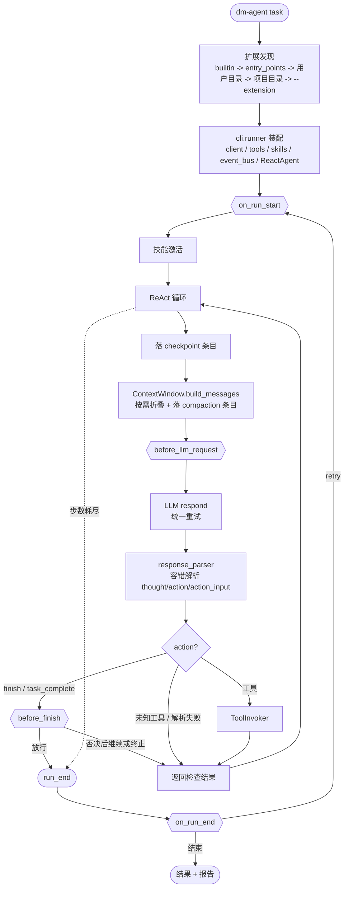
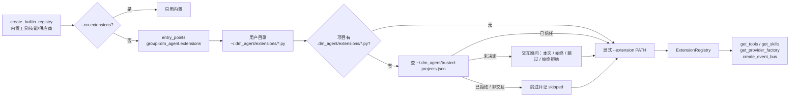
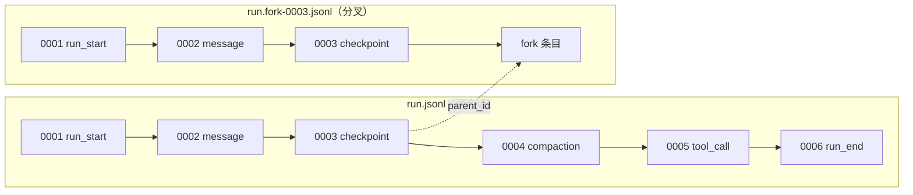

# 架构

**这份文字版是架构的权威来源。** `docs/architecture.drawio` 与几张 png（含面向非开发者的
`project-overview-simple.png`）保留作为附件，但二进制图 AI 读不了、人也没法 diff，改了架构
不一定会有人更新图。两者冲突时以本文为准。

## 一句话

内核只有 ReAct 主循环；每一步的具体环节住在同层模块里，可选能力挂在生命周期钩子上，
运行历史是一棵 append-only 的会话条目树。

## 分层

依赖必须**单向向下**。这条契约由 ruff 的 `TID251` 在 CI 里强制，配置和理由写在
`pyproject.toml` 的 `[tool.ruff.lint.flake8-tidy-imports.banned-api]`。

```
clients      不依赖任何其他 dm_agent 子包
   ↑
tools        只依赖 clients
   ↑
tracing      只依赖 tools / memory（记录汇，不回头依赖 core）
   ↑
core         依赖 clients / tools / memory / prompts / tracing，禁止依赖 cli
   ↑
extensions   依赖 core（把内置能力装到事件总线上）
   ↑
cli          最外层组装者，可以依赖任何层
server       与 cli 同级的另一个最外层组装者；可依赖任何下层，但不得依赖 cli
```

`cli` 是**参考实现，不是被复用的库**。想自己造 agent 就直接用 `dm_agent.core.ReactAgent`，
不必接受这套 CLI 与 UI。

`server`（[Web 控制台](web.md)）与 `cli` 同级而非在它之上：它要发起运行时 **spawn 一个
CLI 子进程**，不把 CLI 当库用。这样 Web 界面永远和命令行做同一件事，不会变成第二套
装配逻辑。三条相关不变式——server 不 import cli、无下层反向依赖 server、
`settings.py` 零 web 依赖——由 `tests/test_server_layering.py` 用 AST 断言，
因为 `dm_agent/server/**` 与 `dm_agent/cli/**` 一样整体豁免了 `TID251`
（否则 `from .settings import` 会被误判），豁免后 ruff 也就管不住 server → cli。

| 包 | 职责 |
| --- | --- |
| `dm_agent/clients/` | 四家 LLM 适配 + 注册制工厂 + 统一重试 |
| `dm_agent/tools/` | 文件、执行、测试、lint、AST、代码索引工具 |
| `dm_agent/prompts/` | system prompt 构造 |
| `dm_agent/memory/` | token 估算 + Mem0 风格原子记忆折叠 |
| `dm_agent/tracing/` | 会话日志写入、读取归一化、分析/diff/fork CLI |
| `dm_agent/core/` | ReAct 主循环 + 每步环节的同层模块 + 事件总线 |
| `dm_agent/extensions/` | 注册表、三来源发现、项目信任、内置能力 |
| `dm_agent/skills/` | 领域技能与选择器 |
| `dm_agent/mcp/` | MCP 配置、客户端、管理器 |
| `dm_agent/benchmarks/` | coding / maintenance 套件与经济学核算 |
| `dm_agent/evals/` | 确定性与真实模型 eval |
| `dm_agent/cli/` | argparse、Config、UI、报告、运行装配 |
| `dm_agent/server/` | Web 控制台：只读审计 API、子进程执行器、SSE 实时流（需 `[web]` extra） |

`tracing/` 内部同样按职责单向拆分：`summary.py` / `analysis.py` 放确定性算法，
`render.py` 只做输出，`replay.py` / `fork.py` 承担显式动作，`cli.py` 只保留参数解析与分发。
这些模块不依赖 `core`，避免形成 `core → tracing → core` 回环。

## `core/` 的模块分工

第 6 步把 `agent.py` 从 1616 行拆到 866 行。`ReactAgent` 现在只做三件事：装配协作者、
跑主循环、维护对话历史。

| 模块 | 负责的环节 |
| --- | --- |
| `agent.py` | 装配 + ReAct 主循环 |
| `run_state.py` | `Step`、`RunContext`（run 级共享的 `run_id`/`step_number`/`metadata`/`history_entry_ids`）、metadata 初值 |
| `prompting.py` | 任务提示词构造与技能激活 |
| `context_window.py` | 构造发给 LLM 的消息，按需折叠旧上下文 |
| `response_parser.py` | 容错 JSON 解析与动作名归一化 |
| `tool_invoker.py` | 工具调用链（见下节） |
| `observation.py` | 观察截断与失败判定 |
| `completion.py` | 完成门禁与结果格式化 |
| `task_plan.py` | 模型调用 `update_plan` 维护任务清单、修订历史与任务作用域 |
| `persistence.py` | checkpoint 编解码、写前备份、`--resume` 加载 |
| `events.py` | 事件总线、事件对象、按 phase 包装的 LLM 客户端 |
| `capabilities.py` | `AgentCapability` 协议与 `CapabilityContext` |
| `guards.py` | read-before-edit 守卫（作为钩子处理器实现） |
| `planner.py` / `replan.py` / `plan_progress.py` | 旧实现与历史实验辅助代码，当前 ReactAgent 不调用 |

> `RunContext` **必须原地改、不能整体替换**——`LLMRequestClient` 在构造期就绑定了它的
> 取值回调，换新实例会让它继续读旧对象。

## 一次 run 的执行链



`{{双花括号}}` 的是钩子点。语义与返回值见 [生命周期事件](lifecycle-events.md)。

计划是模型报告的清单，执行事实由证据图独立记录；工具成功不自动完成计划项，计划全完成也不
绕过完成门禁。当前清单作为单份结构化视图参与消息预算，压缩不会替换它。见[计划与证据协作](task-plan.md)。

## 工具调用链的次序（有意为之）

`core/tool_invoker.py` 的存在理由就是钉住内核护栏与扩展钩子的相对次序：

```
入参校验            非法直接返回 observation，不进钩子、不执行
   ↓
before_tool_call    可就地改 arguments，可返回 {block, reason} 拦下
   ↓                （改完不再重新校验——这是写进文档的约定）
写前备份            只在放行后、真正执行前做；被拦下的调用不备份
   ↓
tool.execute        异常被捕获成 "Tool execution failed: ..."
   ↓
观察截断            先于后置钩子；处理器看到的就是最终写进历史的那份
   ↓
after_tool_result   中间件式串联，后一个看到前一个改过的 observation
```

处理器的执行顺序 = 注册顺序 = **外部扩展 → 可选能力 → 内核内置守卫**。

## 扩展的发现与加载



优先级**从低到高**，同名工具/技能/供应商后者覆盖前者；事件处理器则按同一顺序串联。
每个扩展的 `setup(api)` 是**事务式**执行的：`apply_setup` 先注册到一个暂存 registry，
成功才合并，失败不留下半套注册结果。

加载失败不会中断启动——记进 `ExtensionDiscoveryResult.failures` 并继续；只有
`--extension` 显式指定的文件加载失败才抛 `ExtensionDiscoveryError`。

细节与安全模型见 [扩展开发](extensions.md)。

## 会话数据模型

运行历史是一份 append-only 的 JSONL，每条一个条目：

```json
{"id": "a1b2c3d4-0007", "parent_id": "a1b2c3d4-0006",
 "timestamp": "2026-07-28T09:15:22.481923+00:00", "run_id": "a1b2c3d4...",
 "event": "tool_call", "payload": {"step_number": 3, "action": "read_file"}}
```

- `id` = `<run_id 前 8 位>-<四位序号>`，同一个 writer 内单调递增。
- `parent_id` = 同一 writer 写出的上一条；文件首条为 `""`，**fork 出来的会话首条指回
  源会话的分叉点**——这就是把多份 JSONL 串成一棵树的那根指针。
- `event` / `payload` 沿用 1.x 的拼写（没有改成 `type` / `data`），schema 版本 `2.0`。



条目类型、两个保真档（`--trace` 脱敏 vs `--checkpoint` 完整）、多 sink 扇出、非破坏式折叠与
`rebuild_context` 的 ablation 用法，见 [会话与 trace](tracing.md)。

Agent 持有一个 `SessionWriter` 门面；它把普通会话事件扇出到各个 `TraceWriter`，并按
历史下标为每个 sink 维护独立的 message id 映射。`RunContext.history_entry_ids` 仍保留
主 sink 的兼容视图，折叠起点不会跨文件复用 id。JSONL checkpoint sink 的写入失败按
checkpoint 的“尽力而为”约定隔离并告警，不会拖垮分享档或主循环。

解析失败的 assistant 原文同样不删除：`message` 条目保留原始响应，紧随其后的
`parse_error.context_replacement` 记录后续请求实际采用的短占位。实时历史只使用该派生
视图，`rebuild_context` 也只对显式带此字段的新事件做替换；旧 trace 没有该字段，继续按
当时“原文留在上下文”的语义重建。

## 三条约定

1. **新增能力先问：这个必须住在内核里吗？** 只需要在固定几个点插手的，就该是扩展。
2. **不用「重构」当借口降低验证强度。** 每个重构都要证明 `pytest` + `evals.cli` +
   benchmark manifest 全绿，且 eval 结果与重构前逐字段一致。
3. **原始数据永不删除。** 折叠、截断、摘要只能是「追加一条派生记录 + 构造上下文时跳过原文」。
